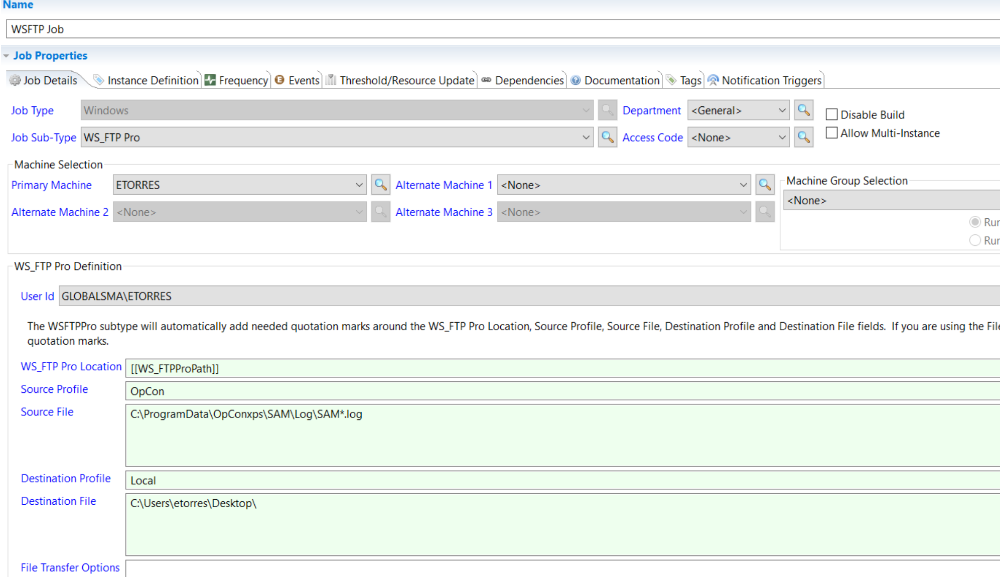
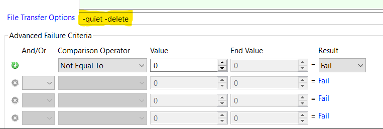
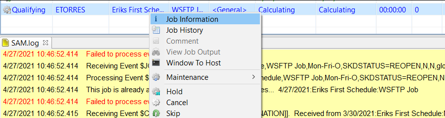
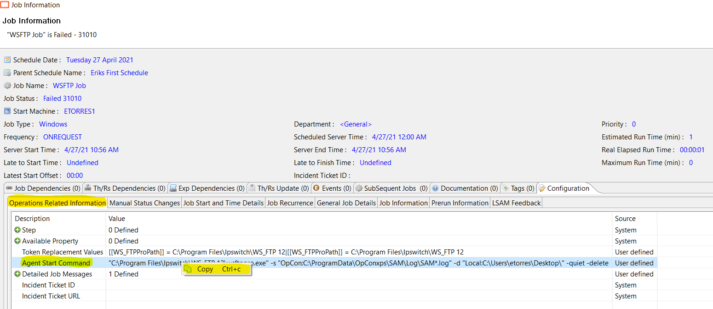

## WS_FTIP Job Failure Troubleshooting

**What is the issue? **

If you're encountering issues with a **WS_FTP job**, this article will guide you step by step to troubleshoot the problem.

**Troubleshooting**

* Ensure the user you're running the job as in **OpCon**, has the profiles already setup with access to **both** the destination and source paths. Please verify that the machine is the same one utilized during setup.
* Next double check the source and destination paths are entered exactly the same as a connection in **WS_FTP GUI**. The profile names should be spelled exactly the same.

If you setup your connection profile to drop you into a certain directory, you will be still be required to specify the **FULL** path to the file.

* If downloading a wild-carded file ensure that you **DO NOT** enter a filename in the destination path.

:::tip Example

* Source: `C:\Users\Test\Example*.txt`
* Destination: `D:\Purple\`

:::

* If your job starts but runs and will not complete it's likely that it's trying to answer a pop up unsuccessfully (ie: *Do you trust this site, are x certificates valid*).

Utilize the File Transfer field to enter **-quiet**. You can also use this field to specify your transfer method **-binary**, **-ascii**, or **-delete** to delete the file from the source location during transfer.

Lastly, please ensure that the file can be transferred outside the GUI using command prompt. If you right click on the job in **OpCon** and go to **Job Information > Configuration**. You can copy the command line (with all Global Properties translated). Paste this in a CMD prompt and verify it works.

Open a Command Prompt and paste the command line used in **OpCon**.

If the job still fails then it means that something permissions, command line, or profile is invalid.

